<p align="center">
  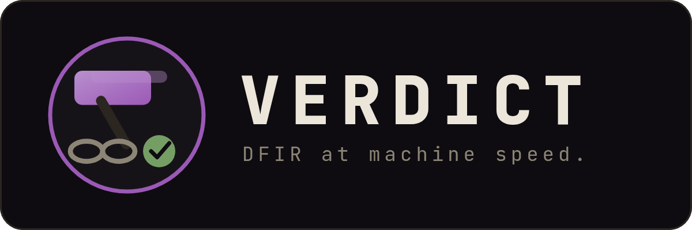
</p>

<p align="center">
  <a href="LICENSE"></a>
  <a href="https://timothyvang.github.io/verdict-dfir/"></a>
  
  
  
</p>

<p align="center"><b>Digital forensics &amp; incident response with a verdict you can prove.</b></p>

---

**VERDICT** automates the repeatable mechanics of a Windows-host DFIR investigation — memory images,
EVTX logs, disk artifacts, and network captures — and produces an evidence-bound verdict
(`SUSPICIOUS` / `INDETERMINATE` / `NO_EVIL`) backed by a cryptographic chain of custody any third
party can verify offline. It runs as a [Claude Code](https://claude.com/claude-code) agent over a
narrow, typed, read-only tool surface, so every Finding cites the exact tool call that produced it.

There is no separate application server — **Claude Code is the engine.** Running `scripts/verdict
<evidence>` (or `claude`) in this repo turns that session into the analyst: it opens the Case, drives
the 43 typed read-only tools, runs the verifier, and signs the verdict. VERDICT reduces the friction
of repeatable DFIR mechanics; it is not an autonomous responder — the analyst approves the plan, and
the verifier re-runs every cited tool before any Finding reaches the report.

## Install and run

| Need | Start here |
|---|---|
| Cold-clone install | [`INSTALL.md`](INSTALL.md) |
| Three-command quickstart | [`QUICKSTART.md`](QUICKSTART.md) |
| Every run mode, flag, and output file | [`docs/using/running-verdict.md`](docs/using/running-verdict.md) |
| Failure-mode fixes | [`docs/troubleshooting.md`](docs/troubleshooting.md) |

```bash
git clone --depth 1 https://github.com/TimothyVang/verdict-dfir.git verdict
cd verdict
bash scripts/setup            # toolchain + DFIR binaries + both MCP servers + preflight doctor
scripts/verdict <path-to-evidence>
```

Point it at supported evidence — a memory image, EVTX log, disk image (`.E01` / `.dd`), packet
capture, Velociraptor collection, or a whole multi-host case folder. Output lands in
`tmp/auto-runs/<case-id>/`. Unsupported formats degrade to custody/limitation records rather than a
broad clearance claim.

Prefer Claude Code interactively? Run `claude` in the repo and type `/verdict <evidence>` or
`investigate <evidence>`.

## What you get

Every run writes a self-contained case directory:

| Artifact | What it is |
|---|---|
| `audit.jsonl` | Append-only, hash-chained log of every tool call and Finding (`prev_hash` per record) |
| `verdict.json` | The evidence-bound verdict and Findings, each citing a `tool_call_id` and a confidence tier |
| `coverage_manifest.json` | Per-artifact-class scope ledger: available / attempted / parsed / failed / unsupported / not-supplied — the explicit anti-overclaim boundary |
| `run.manifest.json` | Merkle root over canonical tool outputs plus signature metadata — verifiable offline |
| `REPORT.md` / `REPORT.html` / `REPORT.pdf` | Analyst report: Findings, ATT&CK coverage, normalized timeline, next actions. `REPORT.md` is always written; `REPORT.html` (needs pandoc) and `REPORT.pdf` (needs headless Chrome) are produced when those tools are present |

<p align="center">
  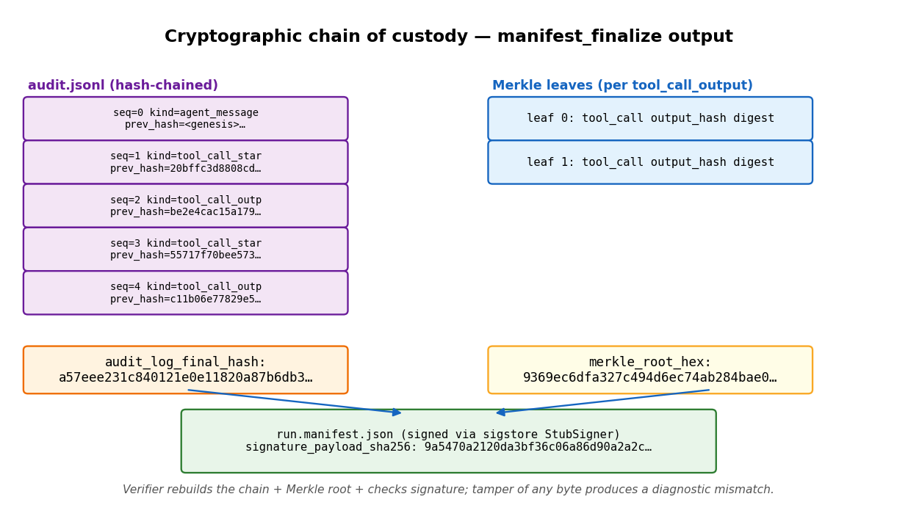
</p>
<p align="center"><sub>Each run seals into a hash-chained audit log, a Merkle root over canonical tool outputs, and a signed manifest — verifiable offline with <code>manifest_verify</code>.</sub></p>

## See it run

Every capture below is a real run, not a mockup. Full gallery: [`docs/showcase/`](docs/showcase/).

<p align="center">
  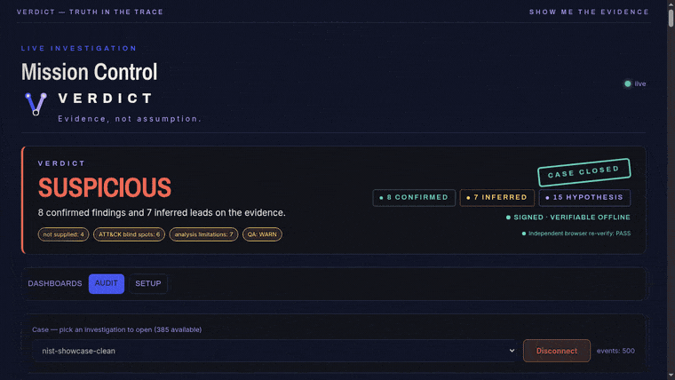
</p>
<p align="center"><sub>One command, the typed DFIR pipeline, a signed <code>SUSPICIOUS</code> verdict with <code>manifest_verify = PASS</code>.</sub></p>

<p align="center">
  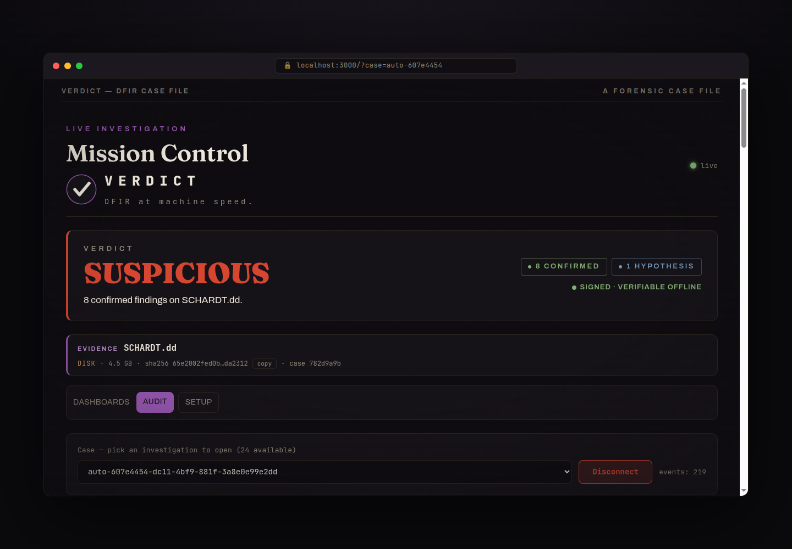
  &nbsp;
  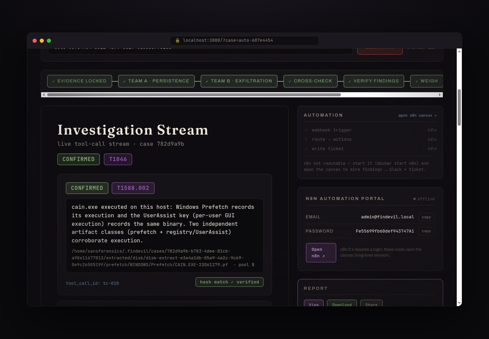
  &nbsp;
  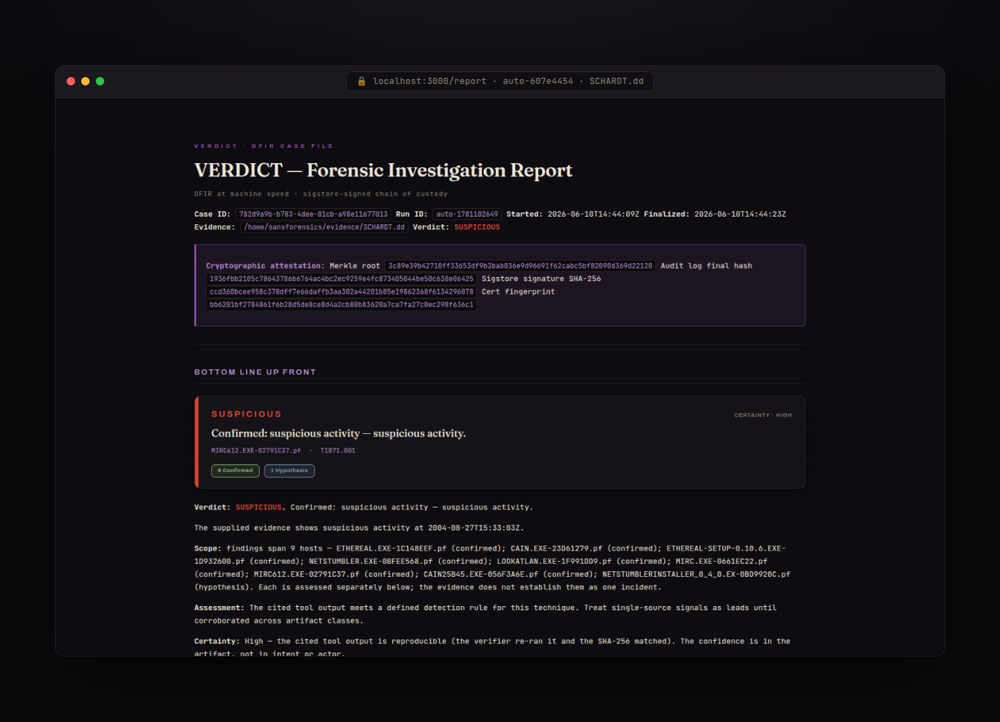
</p>
<p align="center"><sub>The NIST SCHARDT.dd case through SIFT: <code>SUSPICIOUS</code> with 8 confirmed tool executions (cain.exe, mIRC, Ethereal, NetStumbler), each tool-cited, in a signed report.</sub></p>

<p align="center">
  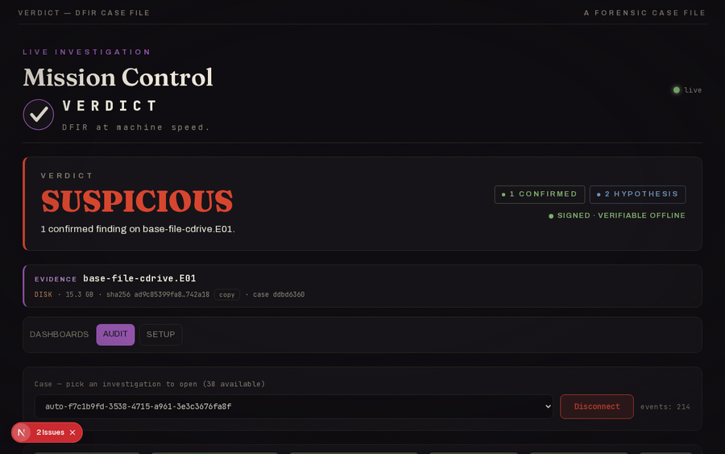
</p>
<p align="center"><sub>A 22-host compromised-enterprise case (SRL-2018, 198&nbsp;GB) run host-by-host with the toolchain executing inside the SANS SIFT VM over SSH. <a href="https://youtu.be/4RQnVden6L8">Showcase walkthrough (4:35)</a>.</sub></p>

<p align="center">
  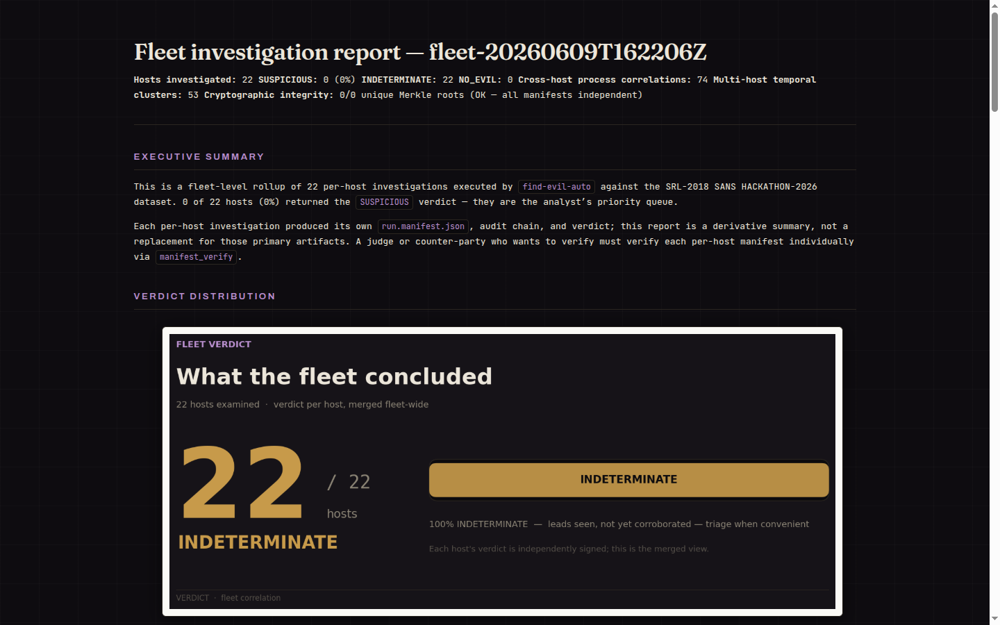
  &nbsp;
  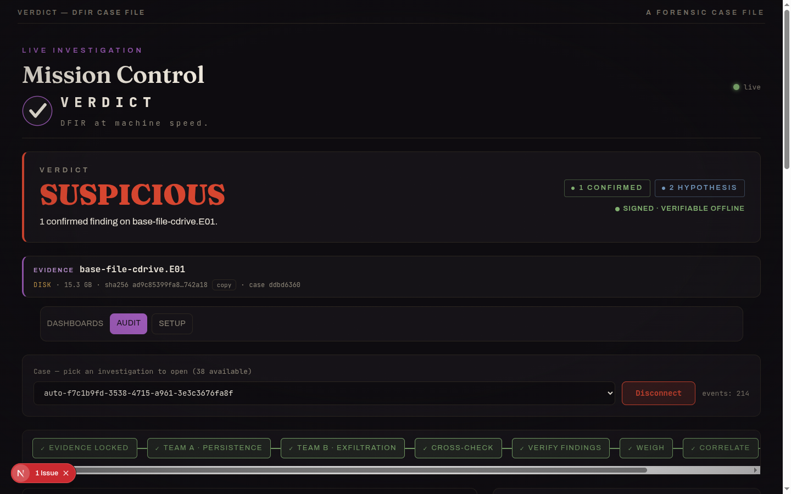
</p>
<p align="center"><sub>Cross-host fleet rollup, and the <code>base-file</code> server flagged <code>SUSPICIOUS</code> on a confirmed Security-log wipe (EID&nbsp;1102), with PowerShell-LOLBin and service-install leads held at <code>HYPOTHESIS</code>.</sub></p>

## How it works

Every Case runs the same nine-stage pipeline, each stage landing live on the dashboard as it completes:

<p align="center">
  
</p>

1. **Evidence locked** — `case_open` SHA-256s the evidence and opens a read-only Case.
2. **Persistence pool** — the first analysis pool forks as a subagent and hunts persistence; every Finding cites the `tool_call_id` that produced it.
3. **Exfiltration pool** — a second pool works the same evidence in parallel with an exfil-biased prior, so competing hypotheses surface instead of hiding in consensus.
4. **Cross-check** — `detect_contradictions` flags disagreeing Findings before anything merges.
5. **Verify** — the verifier re-runs each cited tool and compares output hashes; a Finding whose output drifted is rejected.
6. **Weigh** — `judge_findings` merges by claim with credibility weighting; execution claims need ≥2 artifact classes or stay `HYPOTHESIS`.
7. **Correlate** — `correlate_findings` stitches the survivors into one attack story.
8. **Sign** — `manifest_finalize` seals the run into a hash-chained, Merkle-rooted, signed manifest.
9. **Report** — the analyst report and the verdict.

Three design choices carry the weight:

1. **A typed MCP tool surface — no `execute_shell`.** 43 narrow, schema-validated product tools: 31
   Rust DFIR tools (`case_open`, `vol_pslist`/`psscan`/`psxview`, `mft_timeline`, `evtx_query`,
   `hayabusa_scan`, `yara_scan`, `registry_query`, `prefetch_parse`, `pcap_triage`, and allow-listed
   long-tail wrappers) plus 12 Python crypto/analysis tools. Copyleft and source-available engines
   (Hayabusa, pandoc, tshark, Volatility 3, Velociraptor) are invoked as subprocesses only, keeping
   the Apache-2.0 tree license-clean.
2. **A cryptographic chain of custody.** Hash-chained audit log → Merkle root over canonical-JSON
   tool outputs (computed by the Python manifest builder, mirroring `rs_merkle` semantics) → a signed
   manifest. The default signer is a local Ed25519 key that verifies offline; Sigstore/Rekor is the
   identity and transparency-log tier. `manifest_verify` checks the chain and root offline, and
   customer-release candidates carry an expert-signoff packet. The custody model is framed for
   FRE 902(14) self-authenticating evidence — see
   [`docs/cryptographic-attestation.md`](docs/cryptographic-attestation.md).
3. **Analysis of Competing Hypotheses as agent topology.** Two pools investigate the same evidence
   with opposing priors. Their disagreements are emitted as first-class `kind=contradiction` records
   before a credibility-weighted judge merges them — surfaced, not hidden. Two pools do not prove
   truth; the replayable tool-output chain does.

Findings follow a strict epistemic hierarchy — **CONFIRMED** (≥2 corroborating artifact classes,
verifier-passed) > **INFERRED** (derived from confirmed facts) > **HYPOTHESIS** — and execution
claims require at least two artifact classes.

> **Maturity note.** The long-tail verbs (`vol_run`, `ez_parse`, `plaso_parse`, `mac_triage`,
> `cloud_audit`, `journalctl_query`, `login_accounting`, `ausearch`, `nfdump_query`, `suricata_eve`,
> `indx_parse`) are typed, allow-listed, and unit-tested against fixtures, but not yet exercised on
> real evidence in a committed run. Committed sample runs prove the core
> disk/registry/EVTX/MFT/Prefetch/YARA/USN/Hayabusa/Sysmon/Zeek/PCAP, `vol_*`, `vel_collect`, and
> `browser_history` paths.

## Capabilities

- **Disk and memory in one Case.** With local Sleuth Kit/libewf support or in SIFT mode, it opens
  raw/E01 images read-only and extracts `$MFT`, registry hives, EVTX, and Prefetch
  (`disk_mount` / `disk_extract_artifacts` / `disk_unmount`), then analyzes memory in the same Case.
  Raw disk with no supported mounted/extracted content stays custody-only and honestly `INDETERMINATE`.
  Supported disk images can be parsed locally through Sleuth Kit direct-read when prerequisites are present; `case_open` alone remains custody-only, and unsupported artifact classes stay as named limitations.
  ([tool inventory](docs/reference/mcp-and-tools.md))
- **Self-verifying Findings.** `verify_finding` re-runs each cited tool call and confirms the output
  SHA-256 still matches; `detect_contradictions` raises pool conflicts as first-class records before
  the judge merges — so a third party can independently replay the chain. ([tools](agent-config/TOOLS.md))
- **Fleet scale.** Run a whole estate, not one box: the investigate → correlate → render pipeline
  produces a single cross-host `FLEET_REPORT` surfacing signals that only appear across machines —
  the same uncommon process on many hosts, near-simultaneous process-creation waves, MITRE-technique
  spread. Runs in the SANS SIFT VM ([fleet analysis](docs/using/fleet-analysis.md)) or per-host
  locally with no VM ([whole-case local run](docs/using/whole-case-local-run.md)).
- **Optional post-verdict action.** When the operator deploys an n8n workflow, a verdict can drive a
  notification, ticket, or containment step. Out of the box no workflow is deployed, so the step
  records as skipped. Either way it sits outside the audit chain — never evidence, never a Finding.

## Accuracy and scope

If no parser or tool extracts an artifact class, VERDICT cannot reason over it — that is the trust
boundary, not a footnote. Every run writes a `coverage_manifest.json` sidecar (and embeds the same
object in `verdict.json`) with one row per artifact class. The strongest claim is not "the AI
reviewed the whole image"; it is that the cited artifacts were examined through replayable tools.
Disputed or unsupported leads stay visible as contradictions, `HYPOTHESIS`, or
`analysis_limitations`.

Accuracy is measured against published answer keys, not asserted. The repo ships small answer keys
under `goldens/`; large fixtures are staged with `scripts/fetch-fixtures.sh`, then scored with
`scripts/score-recall.py tmp/auto-runs/<case-id> --golden goldens/<case-id>`. Method, corpus shape,
false-positive controls, and honest limits are in [`docs/accuracy-report.md`](docs/accuracy-report.md);
the adversarial challenge is in [`docs/red-team-challenge.md`](docs/red-team-challenge.md). A compact
committed execution trace for reviewer spot-checks lives in
[`docs/release-evidence/`](docs/release-evidence/): Finding `f-A-evtx-audit-log-cleared` maps to
`evtx_query` tool call `tc-002`, with verifier replay and token usage recorded.

## Getting started

A single command installs the product prerequisites and verifies the environment:

```bash
bash scripts/setup
```

It installs the toolchain (Rust, uv, Node, pnpm) and the supported local DFIR binaries it can manage
(Volatility 3, Hayabusa, Chainsaw, Velociraptor, Sleuth Kit, tshark, pandoc — YARA is built into the
Rust binary), builds and verifies both MCP servers, runs the preflight `doctor`, and prints an honest
green/amber summary. Common variants:

```bash
bash scripts/setup --run         # install, then watch evidence/ and investigate on drop
bash scripts/setup --with-sift   # install local prerequisites and provision the SANS SIFT VM
bash scripts/setup --json        # machine-readable status for scripts/CI
```

<p align="center">
  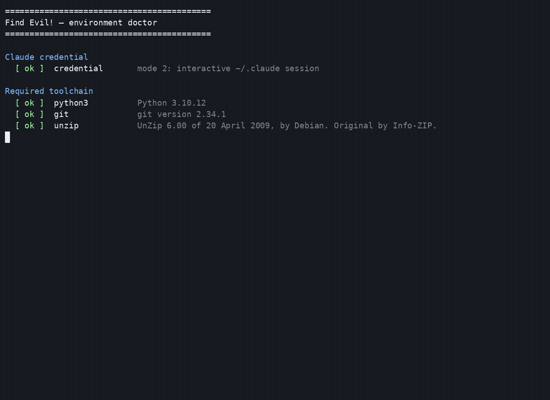
</p>
<p align="center"><sub><code>scripts/doctor.sh</code>: one preflight, an honest green/amber summary, then you are ready to run.</sub></p>

The **SANS SIFT VM** is the reference forensic environment and provides the full workstation baseline
for disk-image parity; `--with-sift` fetches the gated 9.3&nbsp;GB OVA headlessly and builds the VM,
falling back cleanly to local mode (memory, EVTX, PCAP, Velociraptor, and supported disk artifacts)
on any failure. Full prerequisites are in [INSTALL.md](INSTALL.md); per-environment detail (local vs.
SIFT VM) is in [QUICKSTART.md](QUICKSTART.md).

To run a Case, point `verdict` at a single image or a mixed case directory (memory + EVTX + disk +
network + Velociraptor):

```bash
scripts/verdict <path-to-evidence>
#   --sift          run the DFIR tools inside the SANS SIFT VM (default: local host)
#   --watch         watch evidence/ and investigate on the next drop
#   --no-dashboard  do not auto-open the browser
```

The dashboard at `http://localhost:3000` streams the run live. Evidence files are never committed
(they are gitignored), so a fresh clone ships with none — stage public datasets with
`bash scripts/fetch-fixtures.sh` (sources and SHA-256 in [docs/DATASET.md](docs/DATASET.md)) or drop
your own image into `evidence/`. Every run is a live test: confirm `tmp/auto-runs/<case-id>/verdict.json`
carries a real verdict and `manifest_verify.json` reports `overall: true`.

<p align="center">
  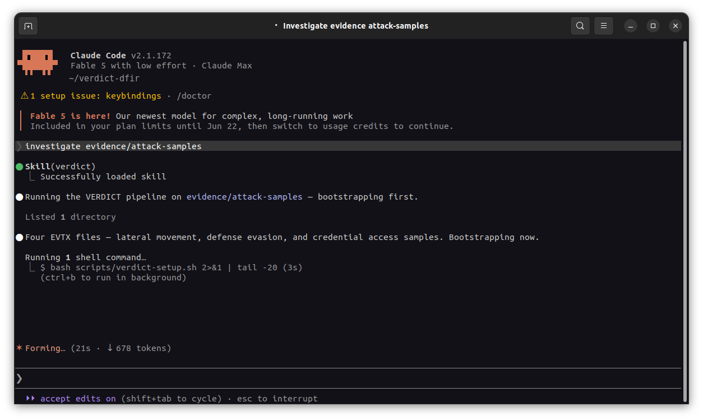
</p>
<p align="center"><sub>Agent mode: one prompt scopes the evidence (four EVTX samples — lateral movement, defense evasion, credential access) and bootstraps the pipeline.</sub></p>

## Repository layout

```
.
├── agent-config/        — runtime agent identity (SOUL / AGENTS / PLAYBOOK / TOOLS / MEMORY)
├── services/mcp/        — Rust MCP server (31 typed DFIR tools)
├── services/agent_mcp/  — Python MCP server (12 crypto / ACH / memory tools)
├── services/agent/      — findevil_agent package (crypto chain + ACH primitives)
├── apps/web/            — Next.js dashboard (live audit-stream viewer + design system)
├── scripts/             — verdict launcher, report renderer, CI smoke runners
├── docs/                — reference/ (tools + deps + env), using/ (how to run), architecture, crypto attestation
└── .mcp.json            — Claude Code auto-spawn registry: 6 MCP servers (2 product + 4 non-product helpers)
```

## Documentation

- [Published docs](https://timothyvang.github.io/verdict-dfir/) — GitHub Pages site
- [docs/README.md](docs/README.md) — canonical documentation index
- [docs/using/running-verdict.md](docs/using/running-verdict.md) — every flag, run mode, and output file
- [docs/reference/mcp-and-tools.md](docs/reference/mcp-and-tools.md) — full MCP-server and tool inventory ([dependencies](docs/reference/dependencies.md))
- [docs/architecture.md](docs/architecture.md) — trust boundaries and the agent topology
- [docs/cryptographic-attestation.md](docs/cryptographic-attestation.md) — chain of custody and FRE 902(14)
- [docs/verdict-semantics.md](docs/verdict-semantics.md) — what `SUSPICIOUS` / `INDETERMINATE` / `NO_EVIL` mean
- [docs/false-positives.md](docs/false-positives.md) — how VERDICT avoids over-claiming
- [docs/release-surface.md](docs/release-surface.md) — release channel and public-source boundaries

> **For coding agents:** read [CLAUDE.md](CLAUDE.md) first — it encodes the document hierarchy, the
> non-negotiable invariants, and the coding principles for this repo.

## License

Apache-2.0. See [LICENSE](LICENSE).

<sub>VERDICT was originally developed for the SANS Find Evil! 2026 challenge and is maintained as a
standalone DFIR tool. Internal identifiers (<code>findevil-mcp</code>, <code>@findevil/web</code>,
<code>scripts/find-evil</code>) retain that name; the canonical operator command is
<code>scripts/verdict</code>.</sub>
